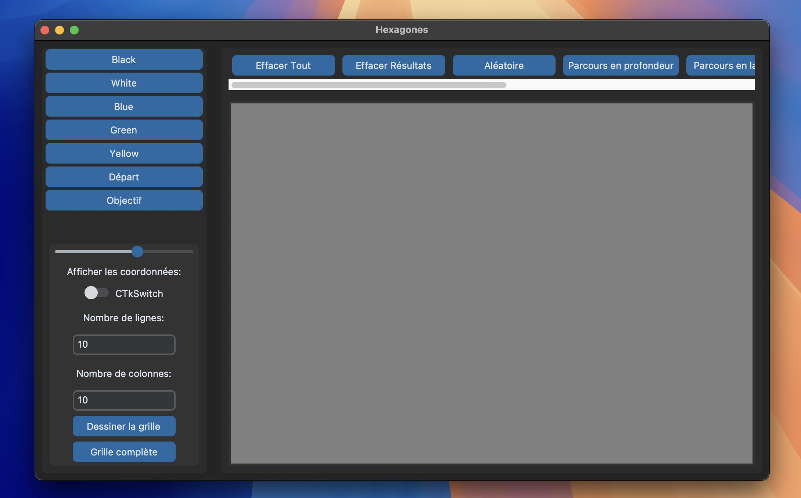

# SAE Semestre 5 : IN5SA01A - Méthodes d'optimisation

>Le logiciel développé dans le cadre d'une SAE (Situation d'Apprentissage et d'Évaluation) est un logiciel interactif qui permet de visualiser l'exécution d'algorithmes de la théorie des graphes.
>
>Ce document présente brièvement le projet ainsi que son contenu et son fonctionnement.

## Sommaire
1. [But du logiciel](#1-but-du-logiciel)
2. [Description](#2-description)
3. [Procédure](#3-procédure)
4. [Utilisation](#4-utilisation)


### 1) But du logiciel
Le but de ce logiciel est de fournir un outil pédagogique permettant de mieux comprendre et visualiser les algorithmes de la théorie des graphes. Il doit permettre aux utilisateurs de suivre pas à pas l'exécution de ces algorithmes, facilitant ainsi l'apprentissage et la compréhension des concepts complexes associés aux graphes.  


***Chemin trouvé par A * sur notre logiciel***


### 2) Description  
Le logiciel a été conçu et développé en utilisant une architecture MVC (Modèle-Vue-Contrôleur) avec le langage **Python**. Cette architecture permet de séparer les différentes responsabilités du logiciel en trois composants principaux : le Modèle, qui gère la logique des graphes et des algorithmes ; la Vue, qui est responsable de l'affichage des données obtenues par le modèle à l'utilisateur ; et le Contrôleur, qui fait le lien entre le Modèle et la Vue en gérant les interactions de l'utilisateur. 

Voici la composition du logiciel (cliquez) :  
* [models](./sae_5_2/models/) : Contient les fichiers relatifs aux modèles, notamment [Node.py](./sae_5_2/models/Node.py) qui permet de créer des nœuds hexagonaux (utilisation de coordonnées hexagonales), ou encore [Grid.py](./sae_5_2/models/Grid.py) qui permet de créer une grille et de joindre correctement les nœuds entre eux.  

* [views](./sae_5_2/views/) : Contient les fichiers qui concernent la vue. La vue principale étant [MainWindow.py](./sae_5_2/views/MainWindow.py), cette classe lie les autres vues contenues dans le répertoire et qui concernent les menus ou encore la grille.  

* [controllers](./sae_5_2/controllers/) : Contient les fichiers relatifs aux Contrôleurs. Encore une fois, ce répertoire est composé d'un contrôleur principal [MainController.py](./sae_5_2/controllers/MainController.py) qui appelle les contrôleurs des différents parcours.

Également, vous retrouverez le sujet de la SAE [ici](./documents/topic.md), la vidéo explicative [ici](./documents/hexagones2.mp4). Vous trouverez aussi un document qui explique brièvement les algorithmes implémentés [ici](./readme.md).


### 3) Procédure  

Il faut tout d'abord cloner le projet en utilisant la commande suivante dans le répertoire voulu, ou bien directement dans votre IDE si vous préférez : 

```shell
git clone https://github.com/Neifko/sae_5_2.git
```

Afin d'exécuter le logiciel, il faut avoir les librairies suivantes installées dans son interpréteur Python : 

* **Tkinter :** Bibliothèque standard de Python pour créer des interfaces graphiques.
* **Ctkinter :** Extension de Tkinter pour des widgets plus avancés.

Si ce n'est pas le cas, vous pouvez créer un environnement virtuel Python et l'activer de la manière suivante (il faut ouvrir un terminal) :

**Sur Windows :**
```shell
python -m venv <nom_environnement>
<nom_environnement>/Scripts/activate
```

**Sur Linux/MacOS :** 
```shell
python3 -m venv <nom_environnement>
source <nom_environnement>/bin/activate
```

Si les étapes ont bien été suivies, le prompt devrait ressembler à cela : 


Finalement, il faut exécuter la commande ci-dessous avec le fichier [requirements.yml](./config/requirements.yml) qui contient les dépendances listées un peu plus haut (il faut se déplacer dans le répertoire du fichier).

```shell
pip install -r requirements.txt
```

### 4) Utilisation

Dans un terminal, afin de lancer le logiciel, il faut se déplacer à la [racine du projet](./) et exécuter la commande suivante : 

```shell
python -m sae_5_2
```
ou
```
python3 -m sae_5_2
```
Une fenêtre Python se lancera avec l'interface graphique du logiciel comme ci-dessous : 



L'interface est composée de trois parties ; le menu de gauche (**LeftNavbar**), le menu d'en haut (**TopNavbar**) et la fenêtre principale (**MainFrame**).

* **LeftNavbar :** Dans ce menu, vous pouvez choisir le nombre de nœuds dans la grille en établissant le nombre de colonnes et de lignes. Vous pouvez également dessiner une grille complète en fonction de la taille de l'écran et agrandir/diminuer la taille des nœuds. Il y a également un bouton poussoir afin d'afficher les coordonnées des nœuds. Finalement, comme dans le sujet, il y a les boutons afin de changer la couleur des nœuds et attribuer des valeurs différentes aux déplacements.

* **TopNavbar :** À l'instar du sujet, ce menu permet de choisir les algorithmes à visualiser ainsi que d'effacer soit les résultats, soit tout.  

* **MainFrame :** Contient l'ensemble des nœuds et permet d'afficher les déplacements et le chemin final en prenant en compte les couleurs.
