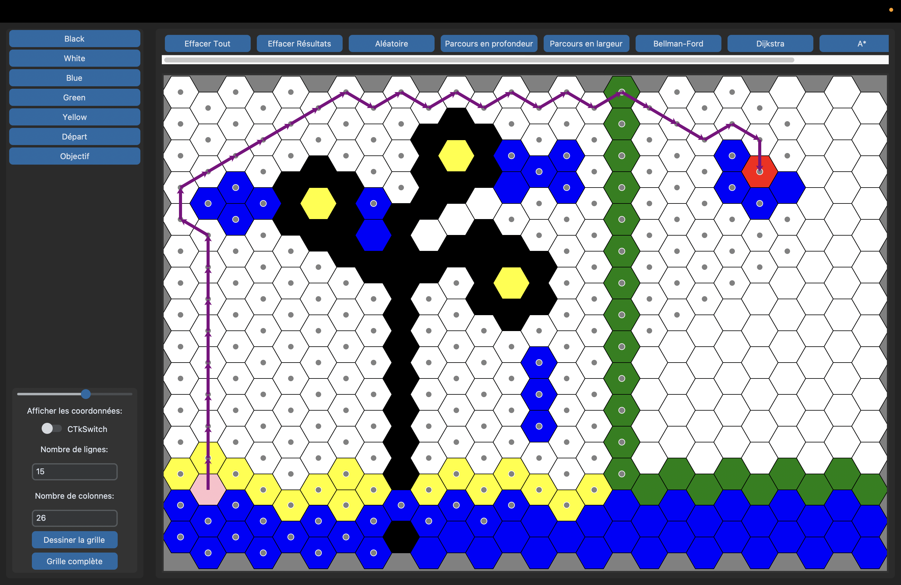

# SAE Semestre 5 : IN5SA01A - Méthodes d'optimisation

>Le logiciel développé dans le cadre d'une SAE (Situation d'Apprentissage et d'Evaluation) est un logiciel interactif qui permet de visualiser l'éxecution d'algorithmes de la théorie des graphes.
>
>Ce document présente brèvement le projet ainsi que son contenu et son fonctionnement.

## Sommaire
1. [But du logiciel](#1-but-du-logiciel)
2. [Description](#2-description)
3. [Procédure](#3-procédure)
4. [Utilisation](#4-utilisation)

### 1) But du logiciel
Le but de ce logiciel est de fournir un outil pédagogique permettant de mieux comprendre et visualiser les algorithmes de la théorie des graphes. Il doit permettre aux utilisateurs de suivre pas à pas l'exécution de ces algorithmes, facilitant ainsi l'apprentissage et la compréhension des concepts complexes associés aux graphes.  

***Chemin trouvé par A* sur notre logiciel***

### 2) Description  

### 3) Procédure

### 4) Utilisation